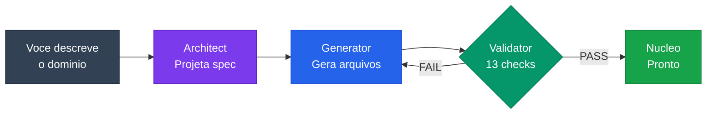
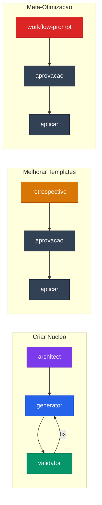

<a id="readme-top"></a>

<div align="center">

# `AI-Workflow-Meta`

**O workflow que cria workflows.**

Sistema meta-workflow para gerar nucleos de AI com estrutura consistente, validada e pronta para uso no Claude Code.

<br>


</div>

<br>

<details>
<summary><strong>Sumario</strong></summary>

- [O Que E](#-o-que-e)
- [Como Funciona](#-como-funciona)
- [Skills (Brains)](#-skills-brains)
- [Templates](#-templates)
- [Pipelines](#-pipelines)
- [Estrutura](#-estrutura)
- [Quick Start](#-quick-start)
- [Ecossistema](#-ecossistema)
- [Licenca](#-licenca)

</details>

---

## O Que E

Um nucleo de AI que **gera outros nucleos de AI**. Voce descreve o dominio, ele projeta a arquitetura, gera todos os arquivos, valida contra 13 criterios de qualidade e entrega pronto para uso.

> Nucleos gerados pelo Meta ja incluem: CLAUDE.md, brain skills com anatomia de 7 secoes, memoria estruturada, routing semantico e pipelines.

---

## Como Funciona



---

## Skills (Brains)

<table>
<tr>
<td align="center" width="20%">
<br>
<strong>Architect</strong>
<br><br>
Analisa dominio e gera<br>Nucleo Spec aprovada
<br><br>
</td>
<td align="center" width="20%">
<br>
<strong>Generator</strong>
<br><br>
Transforma spec em<br>arquivos via templates
<br><br>
</td>
<td align="center" width="20%">
<br>
<strong>Validator</strong>
<br><br>
Audita nucleo contra<br>13 criterios de qualidade
<br><br>
</td>
<td align="center" width="20%">
<br>
<strong>Retrospective</strong>
<br><br>
Analisa nucleos passados<br>e melhora templates
<br><br>
</td>
<td align="center" width="20%">
<br>
<strong>Prompt</strong>
<br><br>
Meta-otimiza a estrutura<br>do proprio workflow
<br><br>
</td>
</tr>
</table>

Cada brain segue a **anatomia padrao de 7 secoes**:

```
Papel → Pre-condicoes → Regras → Templates → Checklist → Post-condicoes → Handoff
```

---

## Templates

6 templates parametrizados com `{{PLACEHOLDER}}` que geram todos os arquivos de um nucleo:

| Template | Gera | Parametros |
|----------|------|------------|
| `claude-md.tmpl.md` | CLAUDE.md (dispatcher) | 9 params — regras, routing, playbooks |
| `brain-skill.tmpl.md` | Brain skills completas | 10 params — 7 secoes da anatomia |
| `context.tmpl.md` | .ai/CONTEXT.md | 6 params — stack, tools, convencoes |
| `memory-knowledge.tmpl.md` | Memoria persistente | Schema fixo com 5 secoes |
| `memory-sessions.tmpl.md` | Log de sessoes | Formato comprimido, max 5 bullets |
| `playbooks.tmpl.md` | Pipelines do nucleo | Sequencia de brains com gates |

---

## Pipelines



---

## Estrutura

```
Nucleo Workflow/
├── CLAUDE.md                          # Dispatcher (Camada 1) — < 100 linhas
├── .claude/skills/
│   ├── workflow-architect/SKILL.md    # Projeta nucleos
│   ├── workflow-generator/SKILL.md    # Gera arquivos
│   ├── workflow-validator/SKILL.md    # Valida qualidade (13 checks)
│   ├── workflow-retrospective/SKILL.md # Melhora templates
│   └── workflow-prompt/SKILL.md       # Meta-otimizacao
├── templates/                         # 6 templates parametrizados
│   ├── claude-md.tmpl.md
│   ├── brain-skill.tmpl.md
│   ├── context.tmpl.md
│   ├── memory-knowledge.tmpl.md
│   ├── memory-sessions.tmpl.md
│   └── playbooks.tmpl.md
├── .ai/                               # Memoria estruturada
│   ├── CONTEXT.md
│   ├── MEMORY_KNOWLEDGE.md
│   └── MEMORY_SESSIONS.md
├── nucleos/
│   └── registry.md                    # Registro de nucleos gerados
└── docs/superpowers/                  # Specs e planos
```

---

## Quick Start

1. Clone o repositorio na sua maquina
2. Abra com **Claude Code** no diretorio do projeto
3. O CLAUDE.md carrega automaticamente e inicializa o workflow
4. Descreva o dominio do nucleo que deseja criar
5. O pipeline `architect → generator → validator` faz o resto

```bash
git clone https://github.com/Jojozinho21/AI-Workflow-Meta.git
cd AI-Workflow-Meta
# Abra com Claude Code e diga o dominio que quer criar
```

---

## Validacao de Qualidade

O Validator aplica **13 verificacoes** em todo nucleo gerado:

<table>
<tr>
<td width="50%">

1. CLAUDE.md < 100 linhas
2. Skills < 400 linhas
3. Frontmatter valido
4. 3+ trigger phrases por skill
5. Zero duplicacao de regras
6. Pre-condicoes em cada brain
7. Post-condicoes em cada brain

</td>
<td width="50%">

8. Checklist de self-review
9. Routing cobre todos brains
10. Playbooks referenciam brains validos
11. Memoria com schema rigido
12. Nenhum placeholder/TODO
13. Toda regra com justificativa (WHY)

</td>
</tr>
</table>

---

## Ecossistema

Parte da familia **AI-Workflow** por [Jonathan Locks](https://github.com/Jojozinho21):

| Workflow | Dominio | Skills |
|----------|---------|--------|
| [**AI-Workflow-Meta**](https://github.com/Jojozinho21/AI-Workflow-Meta) | Meta-workflow (este repo) | 5 brains |
| [**AI-Workflow-Discord**](https://github.com/Jojozinho21/AI-Workflow-Discord) | Bots Discord (TypeScript) | 8 brains |
| [**AI-Workflow-SobbleMC**](https://github.com/Jojozinho21/AI-Workflow-SobbleMC) | Plugins Minecraft (Java) | 3 skills |

---

## Principios

| Principio | Aplicacao |
|-----------|-----------|
| **Toda regra tem WHY** | Regras sem justificativa sao ignoradas pelo modelo |
| **Progressive Disclosure** | CLAUDE.md leve, conteudo pesado em skills e references |
| **Generator-Critic** | Loop architect → generator → validator com max 2 iteracoes |
| **Memoria Estruturada** | Tabelas e bullets parseveis, nunca paragrafos |
| **Domain-Agnostic** | Templates parametrizados servem qualquer dominio |

---

## Licenca

Distribuido sob licenca MIT. Veja [`LICENSE`](LICENSE) para mais informacoes.

---

<div align="center">

Feito com Claude Code por **Jonathan Locks**

[SobbleMC](https://github.com/Jojozinho21)

</div>

<p align="right"><a href="#readme-top">voltar ao topo</a></p>
